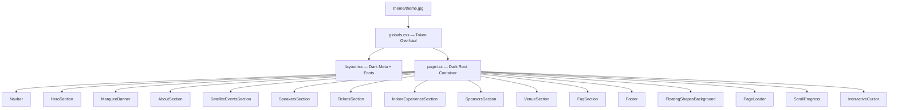

# DevFest Indore 2026 — New Theme Update Plan
**Based on:** `theme/theme.jpg` — Dark Holographic GDG Theme  
**Scope:** Full project overhaul of all components, styles, and global tokens  
**Current Date:** October 5, 2026

---

## 1. Theme Vision & Design Language

### 1.1 What the Theme Image Tells Us

| Attribute | Current (Light) | New (Dark Holographic) |
|---|---|---|
| **Background** | `#fafbfc` (off-white) | `#000000` / `#0a0a0a` (jet black) |
| **Primary Text** | `#1e1e1e` (near-black) | `#ffffff` (pure white) |
| **Accent Colors** | Flat Google pastels | Iridescent/rainbow gradients |
| **Cards** | White with black border + shadow | Dark glass (`#111`/`#1a1a1a`) with glow borders |
| **Icons/Shapes** | Flat colored shapes | Holographic Android + Web Globe with gradient fills |
| **Typography** | Bold, flat color | Large, gradient-filled lettering |
| **Mood** | Playful, Awwwards-light | Premium, dark, neon-festival |
| **Borders** | `2px solid #1e1e1e` | Subtle glowing gradient borders |
| **Corner elements** | Geometric pastel shapes | Organic black blobs / neon corner shapes |

### 1.2 New Design System Tokens

```
/* Dark Base */
--page-bg:        #000000
--surface-1:      #0d0d0d   (card backgrounds)
--surface-2:      #141414   (nested surfaces)
--surface-3:      #1a1a1a   (hover states)

/* Text */
--text-primary:   #ffffff
--text-muted:     #9aa0a6   (was #5f6368)
--text-subtle:    #5f6368

/* Google Brand (unchanged hex, new usage) */
--google-blue:    #4285f4
--google-red:     #ea4335
--google-yellow:  #f9ab00
--google-green:   #34a853

/* Holographic Gradient (the core of the new theme) */
--gradient-holo:  linear-gradient(135deg, #4285f4, #34a853, #f9ab00, #ea4335, #57caff, #ff7daf)
--gradient-text:  linear-gradient(90deg, #4285f4 0%, #34a853 25%, #f9ab00 60%, #ea4335 100%)
--gradient-hero:  linear-gradient(120deg, #4285f4, #9b59b6, #ea4335, #f9ab00, #34a853)

/* Glow Effects */
--glow-blue:      0 0 20px rgba(66,133,244,0.4)
--glow-red:       0 0 20px rgba(234,67,53,0.4)
--glow-yellow:    0 0 20px rgba(249,171,0,0.4)
--glow-green:     0 0 20px rgba(52,168,83,0.4)
--glow-holo:      0 0 30px rgba(66,133,244,0.3), 0 0 60px rgba(234,67,53,0.15)

/* Borders */
--border-dark:    rgba(255,255,255,0.08)   (subtle card borders)
--border-glow:    rgba(66,133,244,0.5)     (active/hover borders)

/* Scrollbar */
--scrollbar-track: #0d0d0d
--scrollbar-thumb: linear-gradient(#4285f4, #ea4335)
```

---

## 2. Architecture of Changes



---

## 3. File-by-File Change Plan

### 3.1 `src/app/globals.css` — **Core Token Overhaul**

**What changes:**
- Replace all `:root` color variables with the dark theme token set
- Remove `color-scheme: light !important` → set `color-scheme: dark`
- Change `body` background to `#000000`, text to `#ffffff`
- Replace `::selection` from yellow-pastel to `bg: #4285f4/40, color: white`
- Replace scrollbar track to `#0d0d0d`, thumb to gradient blue→red
- Replace `.bg-grid-pattern` dot color from `#d1d5db` → `rgba(255,255,255,0.06)`
- Replace `.bg-dot-blue` from light to `rgba(66,133,244,0.15)`
- Add new CSS utilities:
  - `.holo-text` — `background: var(--gradient-text); -webkit-background-clip: text; color: transparent`
  - `.glow-card` — dark surface + glow border + backdrop-blur
  - `.glass-surface` — `background: rgba(255,255,255,0.04); backdrop-filter: blur(12px); border: 1px solid rgba(255,255,255,0.08)`
  - `.neon-border-blue/red/green/yellow` — box-shadow glow variants
  - `.dark-pill` — replaces `.google-pill-shadow` for dark mode (subtle white shadow)
- Update `.glow-btn` gradient to be more vivid on dark bg; `.glow-btn__surface` from white to `#0d0d0d`/dark
- Update `.google-card-shadow` from `box-shadow: 0 6px 0 #1e1e1e` → `box-shadow: 0 6px 0 rgba(66,133,244,0.5)` (blue glow shadow)
- Update `.spotlight-card::before` radial gradient → `rgba(66,133,244,0.18)` on dark bg
- Add `@keyframes holo-shift` — animated gradient background-position for holographic shimmer
- Add `@keyframes glow-pulse` — pulsing box-shadow for neon card borders

**New keyframes to add:**
```css
@keyframes holo-shift {
  0%,100% { background-position: 0% 50%; }
  50%      { background-position: 100% 50%; }
}
@keyframes glow-pulse-blue {
  0%,100% { box-shadow: 0 0 15px rgba(66,133,244,0.3); }
  50%      { box-shadow: 0 0 35px rgba(66,133,244,0.7); }
}
@keyframes glow-pulse-multi {
  0%   { box-shadow: 0 0 20px rgba(66,133,244,0.4); }
  33%  { box-shadow: 0 0 20px rgba(234,67,53,0.4); }
  66%  { box-shadow: 0 0 20px rgba(249,171,0,0.4); }
  100% { box-shadow: 0 0 20px rgba(52,168,83,0.4); }
}
```

---

### 3.2 `src/app/layout.tsx` — **Dark Meta + Theme Color**

**What changes:**
- `themeColor` → `#000000` (was `#4285f4`)
- `body` className → `bg-[#000000] text-white`
- `selection:bg-[#4285f4]/40 selection:text-white` (was yellow)
- Keep same fonts (`Plus_Jakarta_Sans`, `Space_Grotesk`) — they work well on dark

---

### 3.3 `src/app/page.tsx` — **Dark Root Wrapper**

**What changes:**
- Root `div` `bg-[#fafbfc]` → `bg-[#000000]`
- Text color `text-[#1e1e1e]` → `text-white`
- `selection:bg-[#ffe7a5] selection:text-[#1e1e1e]` → `selection:bg-[#4285f4]/40 selection:text-white`

---

### 3.4 `src/components/Navbar.tsx` — **Dark Glass Nav**

**What changes:**
- Top 4-color band: keep same colors, increase height slightly to `h-2` for dark visibility
- Header scrolled state: `bg-white/92` → `bg-black/80 backdrop-blur-xl border-b border-white/10`
- Header unscrolled: `bg-transparent` (unchanged, dark page shows through)
- Logo box: `bg-white border-[#1e1e1e]` → `bg-[#0d0d0d] border-white/20 shadow-[0_0_12px_rgba(66,133,244,0.3)]`
- Logo text `text-[#1e1e1e]` → `text-white`
- `2026` badge: `bg-[#ffe7a5]` → `bg-[#f9ab00]/20 border-[#f9ab00]/50 text-[#f9ab00]`
- Nav pill container: `bg-[#f0f0f0]/90` → `bg-white/5 border-white/10`
- Nav link text: `text-[#1e1e1e]` → `text-white/80`; hover `bg-white/10`
- Nav link roll-bottom: keep `text-[#4285f4]`
- Saved sessions button: `bg-[#c3ecf6]` → `bg-[#4285f4]/20 border-[#4285f4]/50 text-white`
- Mobile drawer: `bg-white` → `bg-[#0d0d0d] border-white/10`
- Mobile links hover: `hover:bg-[#c3ecf6]/40` → `hover:bg-[#4285f4]/15`
- Mobile "Get DevFest Tickets" button: keep `bg-[#4285f4]` (pops well on dark)

---

### 3.5 `src/components/HeroSection.tsx` — **Flagship Dark Hero**

**What changes:**
- Section bg: `bg-[#fafbfc] bg-grid-pattern` → `bg-[#000000] bg-grid-pattern` (grid dots now white/subtle)
- Ambient halos: increase opacity/saturation for dark bg — `bg-[#4285f4]/25 blur-3xl` (blue), `bg-[#f9ab00]/20` (yellow), `bg-[#34a853]/20` (green), `bg-[#ea4335]/15` (red)
- Eyebrow badge: `bg-white border-[#1e1e1e]` → `bg-white/5 border-white/15 glass-surface`; text `text-[#1e1e1e]` → `text-white`; `text-[#4285f4]` stays
- **H1 headline:** `text-[#1e1e1e]` → `text-white`; gradient span stays/enhanced `from-[#4285f4] via-[#f9ab00] to-[#34a853]` (matches theme's rainbow `DevFest`)
- Body text: `text-[#1e1e1e]/85` → `text-white/75`
- Fact bar pills: `bg-white border-gray-200` → `bg-white/5 border-white/10 text-white`; icons keep colors
- "Registrations Open" badge: `bg-[#ccf6c5] border-[#5cdb6d]` → `bg-[#34a853]/20 border-[#34a853]/50 text-[#34a853]`
- **Buttons:**
  - Primary (Get Tickets): `bg-[#4285f4]` — keep, enhanced glow: add `shadow-[0_0_25px_rgba(66,133,244,0.5)]`
  - Explore Agenda: `bg-[#ffe7a5]` → `bg-[#f9ab00]/15 text-[#f9ab00] border-[#f9ab00]/40` neon yellow
  - CFP: `bg-white` → `bg-white/5 border-white/20 text-white/80`
- **Countdown timer box:** `bg-white border-[#1e1e1e]` → `glass-surface` with `border border-white/10 bg-[#0d0d0d]`
  - "Live Clock" badge: `bg-[#ccf6c5]` → `bg-[#34a853]/20 text-[#34a853]`
  - Days box: `bg-[#c3ecf6] border-[#57caff]` → `bg-[#4285f4]/15 border-[#4285f4]/40 text-white`
  - Hours: `bg-[#ffe7a5] border-[#ffd427]` → `bg-[#f9ab00]/15 border-[#f9ab00]/40 text-white`
  - Minutes: `bg-[#ccf6c5] border-[#5cdb6d]` → `bg-[#34a853]/15 border-[#34a853]/40 text-white`
  - Seconds: `bg-[#f8d8d8] border-[#ff7daf]` → `bg-[#ea4335]/15 border-[#ea4335]/40`; text `text-[#ea4335]`
- **Mascot card:** `bg-white border-[#1e1e1e]` → `bg-[#0d0d0d] border border-white/10 shadow-[0_0_40px_rgba(66,133,244,0.2)]`
  - Card header border: `border-gray-100` → `border-white/8`
  - Footer `border-gray-100` → `border-white/8`
  - `indore.devfest.2026` text: `text-[#5f6368]` → `text-white/40`
  - Mascot image container: `from-[#fafafa] to-[#f0f0f0]` → `from-[#0d0d0d] to-[#1a1a1a]`
  - Card footer text: `text-[#1e1e1e]` → `text-white`; `text-[#5f6368]` → `text-white/50`
  - Confetti button: `bg-[#ffe7a5]` → `bg-[#f9ab00]/20 border-white/20 text-[#f9ab00]`
- **Floating stickers:**
  - `#1 Cleanest City`: `bg-[#ffe7a5] border-[#1e1e1e]` → `bg-[#f9ab00]/15 border-[#f9ab00]/50 text-[#f9ab00]`
  - GenAI Labs: `bg-[#ccf6c5] border-[#1e1e1e]` → `bg-[#34a853]/15 border-[#34a853]/50 text-[#34a853]`
  - 1500+ Devs: `bg-[#c3ecf6] border-[#1e1e1e]` → `bg-[#4285f4]/15 border-[#4285f4]/50 text-[#4285f4]`
  - Poha Jalebi: `bg-[#f8d8d8] border-[#1e1e1e]` → `bg-[#ea4335]/15 border-[#ea4335]/50 text-[#ea4335]`

---

### 3.6 `src/components/MarqueeBanner.tsx` — **Dark Neon Marquee**

**What changes:**
- Container: `bg-white border-y-[#1e1e1e]` → `bg-[#0a0a0a] border-y-white/10`
- Tech row pill colors (map each pastel to its dark neon equivalent):
  - `bg-[#c3ecf6] border-[#57caff]` → `bg-[#4285f4]/15 border-[#4285f4]/40 text-white`
  - `bg-[#ccf6c5] border-[#5cdb6d]` → `bg-[#34a853]/15 border-[#34a853]/40 text-white`
  - `bg-[#f8d8d8] border-[#ff7daf]` → `bg-[#ea4335]/15 border-[#ea4335]/40 text-white`
  - `bg-[#ffe7a5] border-[#ffd427]` → `bg-[#f9ab00]/15 border-[#f9ab00]/40 text-white`
- Vibe row (solid Google colors) — keep but adjust for dark:
  - `bg-[#34a853] text-white border-[#1e1e1e]` → `bg-[#34a853] text-white border-[#34a853]/50` (keep solid, add slight glow)
  - `bg-[#4285f4] text-white border-[#1e1e1e]` → `bg-[#4285f4] text-white border-[#4285f4]/50`
  - `bg-[#ea4335] text-white border-[#1e1e1e]` → `bg-[#ea4335] text-white border-[#ea4335]/50`
  - `bg-[#f9ab00] text-[#1e1e1e] border-[#1e1e1e]` → `bg-[#f9ab00] text-black border-[#f9ab00]/50`

---

### 3.7 `src/components/AboutSection.tsx` — **Dark About**

**What changes:**
- Section bg: `bg-[#fafbfc]` → `bg-[#000000]`
- Eyebrow pill: `bg-white border-[#1e1e1e]` → `glass-surface border-white/15`; text `text-[#1e1e1e]` → `text-white`
- H2: `text-[#1e1e1e]` → `text-white`; `text-[#34a853]` stays (green glows on dark)
- Body text: `text-[#5f6368]` → `text-white/55`
- **Feature Story Banner (CardTilt):** `bg-white border-[#1e1e1e]` → `bg-[#0d0d0d] border-white/10`
  - Image overlay: `bg-white/95` → `bg-black/80`
  - `DevFest 2026 Spirit` text keep `text-[#34a853]`
  - Tag pill: `bg-[#ffe7a5] border-[#ffd427]` → `bg-[#f9ab00]/15 border-[#f9ab00]/40 text-[#f9ab00]`
  - H3: `text-[#1e1e1e]` → `text-white`
  - Body paragraphs: `text-[#1e1e1e]/80` → `text-white/70`
  - Stats tiles: `bg-[#c3ecf6]/40 border-[#57caff]/40` → `bg-[#4285f4]/10 border-[#4285f4]/25`; text `text-[#4285f4]` → keep
  - `bg-[#ccf6c5]/40 border-[#5cdb6d]/40` → `bg-[#34a853]/10 border-[#34a853]/25`; text stays
- **4 Pillars Cards:**
  - Blue: `bg-[#c3ecf6] border-[#57caff]` → `bg-[#4285f4]/12 border-[#4285f4]/35`
  - Green: `bg-[#ccf6c5] border-[#5cdb6d]` → `bg-[#34a853]/12 border-[#34a853]/35`
  - Yellow: `bg-[#ffe7a5] border-[#ffd427]` → `bg-[#f9ab00]/12 border-[#f9ab00]/35`
  - Red: `bg-[#f8d8d8] border-[#ff7daf]` → `bg-[#ea4335]/12 border-[#ea4335]/35`
  - All pillar text: `text-[#1e1e1e]` → `text-white`
  - Icon box: `bg-white border-[#1e1e1e]` → `bg-white/5 border-white/15`
  - Tag pill bg: `bg-white/90` → `bg-white/10`
- **Stats Counter Strip:** `bg-white border-[#1e1e1e]` → `bg-[#0d0d0d] border-white/10`
  - Label `text-[#5f6368]` → `text-white/45`
  - All stat tile bgs → dark equivalents (same pattern as pillars)
  - Stat numbers `text-[#1e1e1e]` → `text-white`

---

### 3.8 `src/components/SatelliteEventsSection.tsx` — **Dark Timeline**

**What changes:**
- Section bg: `bg-[#fafbfc]` → `bg-[#000000]`; `border-t-[#1e1e1e]` → `border-t-white/10`
- Eyebrow pill: glass-surface dark
- H2: `text-[#1e1e1e]` → `text-white`; gradient span keeps colors
- Body text: → `text-white/55`
- "One City" badge: `bg-[#ffe7a5] border-[#ffd427]` → `bg-[#f9ab00]/15 border-[#f9ab00]/40 text-[#f9ab00]`
- **Filter toolbar:** `bg-white border-[#1e1e1e]` → `bg-[#0d0d0d] border-white/10`
  - Category pills active: `bg-[#1e1e1e] text-white` → `bg-white text-black` (inverted for dark bg contrast)
  - Inactive: `bg-[#fafbfc] text-[#1e1e1e]` → `bg-white/5 text-white/70`
- **Date Banner Headers** — keep the solid Google color approach (yellow/blue/pink slab headers look great on dark)
  - Adjust text: ensure `text-black` stays on yellow/light slabs
- **Event Cards (CardTilt):** `bg-white border-[#1e1e1e]` → `bg-[#0d0d0d] border-white/10`
  - Left accent border colors → keep same (they glow nicely on dark)
  - Host tag: `bg-gray-100 border-gray-300` → `bg-white/8 border-white/15 text-white`
  - Title: `text-[#1e1e1e]` → `text-white`
  - Description: `text-[#1e1e1e]/80` → `text-white/65`
  - Perks chips: `bg-[#fafbfc] border-gray-200` → `bg-white/5 border-white/10 text-white/80`
  - Color badges (blue/green/yellow/red variants): swap bg/border to their `/20` dark equivalents
- **RSVP Modal:** `bg-white border-[#1e1e1e]` → `bg-[#0d0d0d] border-white/15`
  - All form inputs: `border-gray-300` → `border-white/15 bg-[#1a1a1a] text-white`
  - Labels: → `text-white`

---

### 3.9 `src/components/SpeakersSection.tsx` — **Dark Speaker Cards**

**What changes:**
- Section bg: `bg-[#fafbfc]` → `bg-[#000000]`
- Eyebrow pill: glass-surface dark
- H2: → `text-white`; `text-[#ea4335]` stays
- Body text: → `text-white/55`
- **Track filter pills:** active `bg-[#1e1e1e] text-white` → `bg-white text-black` (strong contrast on dark)
- **Speaker Cards:**
  - `bg-white border-[#1e1e1e]` → `bg-[#0d0d0d] border-white/10`
  - Avatar container border `border-[#1e1e1e]` → `border-white/15`
  - Speaker name: `text-[#1e1e1e]` → `text-white`; hover `text-[#4285f4]` stays
  - Role: `text-[#5f6368]` → `text-white/50`
  - Company chip: `bg-gray-100 border-gray-200` → `bg-white/8 border-white/10 text-white/70`
  - Talk topic box: `bg-[#fafbfc] border-gray-200` → `bg-white/5 border-white/8`
  - Topic label: `text-[#5f6368]` → `text-white/40`
  - Topic text: `text-[#1e1e1e]` → `text-white/90`
  - Bottom border: `border-gray-100` → `border-white/8`
  - "View Bio" text: keep `text-[#4285f4]`; roll-bottom `text-[#ea4335]`
- **Badge styles** (corner tags): swap pastels to dark equivalents
  - Blue: `bg-[#c3ecf6] text-[#1e1e1e] border-[#57caff]` → `bg-[#4285f4]/20 text-[#4285f4] border-[#4285f4]/50`
  - Green: → `bg-[#34a853]/20 text-[#34a853] border-[#34a853]/50`
  - Yellow: → `bg-[#f9ab00]/20 text-[#f9ab00] border-[#f9ab00]/50`
  - Red: → `bg-[#ea4335]/20 text-[#ea4335] border-[#ea4335]/50`
- **CFP Banner (CardTilt):** `bg-white border-[#1e1e1e]` → `bg-[#0d0d0d] border-white/10`
  - Mic icon box: `bg-[#ffe7a5]` → `bg-[#f9ab00]/20`
  - "Community Stage" chip: `bg-[#ccf6c5]` → `bg-[#34a853]/20 text-[#34a853]`
  - Title/body: → white
- **Speaker Modal:** `bg-white border-[#1e1e1e]` → `bg-[#0d0d0d] border-white/15`
  - Track chip: `bg-white border-gray-300` → `bg-white/8 border-white/15 text-white`
  - Social buttons: `border-gray-200` → `border-white/10`

---

### 3.10 `src/components/TicketsSection.tsx` — **Dark Ticket + Badge**

**What changes:**
- Section bg: `bg-white` → `bg-[#000000]`
- Eyebrow pill: dark glass
- H2: → `text-white`; `text-[#34a853]` stays
- Body text: → `text-white/55`
- **Ticket CTA box:** `bg-[#fff8e5] border-[#1e1e1e]` → `bg-[#0d0d0d] border-white/10`
  - Top gradient bar: keep `from-[#4285f4] via-[#34a853] to-[#f9ab00]`
  - Inner pill: `bg-white border-[#1e1e1e]` → `bg-white/5 border-white/15`
  - Title: → `text-white`
  - Body: → `text-white/60`
  - Check marks perks: → `text-white`
  - "Grab Pass" button: `bg-[#f9ab00]` → keep + add `shadow-[0_0_20px_rgba(249,171,0,0.4)]`
- **Badge Generator section:** `bg-[#fafbfc] border-[#1e1e1e]` → `bg-[#0a0a0a] border-white/10`
  - Shimmer pill: `bg-[#ffe7a5] border-[#ffd427]` → `bg-[#f9ab00]/15 border-[#f9ab00]/40 text-[#f9ab00]`
  - H3: → `text-white`
  - Body: → `text-white/55`
  - **Controls form (bg-white):** → `bg-[#0d0d0d] border-white/10`
    - Labels: → `text-white`
    - Inputs: `border-gray-300` → `border-white/15 bg-[#1a1a1a] text-white placeholder:text-white/30`
    - Select: same as inputs; `bg-white` → `bg-[#1a1a1a]`
    - "Claim Badge" btn: `bg-[#4285f4]` — keep + add glow
  - **Badge Preview card:** `bg-white border-[#1e1e1e]` → `bg-[#0d0d0d] border-white/15`
    - Avatar bg: `from-gray-100 to-gray-200` → `from-[#1a1a1a] to-[#0d0d0d]`
    - Attendee name: → `text-white`
    - Org text: `text-[#5f6368]` → `text-white/45`
    - QR section: `bg-gray-50 border-gray-200` → `bg-white/5 border-white/10`
    - Pass text: `text-[#5f6368]` → `text-white/40`
    - Venue text: → `text-white/70`
    - Bottom color bar: keep 4 Google colors
    - Lanyard clip `bg-gray-400` → `bg-white/30`
  - **Badge accent colors on dark:**
    - Blue header: `bg-[#4285f4]` → keep + `shadow-[0_0_15px_rgba(66,133,244,0.4)]`
    - Green: keep + green glow
    - Yellow: `bg-[#f9ab00] text-[#1e1e1e]` → keep
    - Red: keep + red glow
- **Checkout Modal:** `bg-white border-[#1e1e1e]` → `bg-[#0d0d0d] border-white/15`
  - Close btn: `bg-[#f0f0f0]` → `bg-white/10 text-white`
  - Title: → `text-white`; body: → `text-white/60`
  - KonfHub iframe border: → `border-white/10`

---

### 3.11 `src/components/IndoreExperienceSection.tsx` — **Dark Culture Cards**

**What changes:**
- Section bg: `bg-[#fafbfc]` → `bg-[#000000]`
- Eyebrow pill: dark glass
- H2: → `text-white`; `text-[#34a853]` stays
- Body text: → `text-white/55`
- **4 Experience Cards (CardTilt):** swap pastel bg to dark:
  - Green: `bg-[#ccf6c5]/50 border-[#5cdb6d]` → `bg-[#34a853]/10 border-[#34a853]/35`
  - Yellow: `bg-[#ffe7a5]/50 border-[#ffd427]` → `bg-[#f9ab00]/10 border-[#f9ab00]/35`
  - Blue: `bg-[#c3ecf6]/50 border-[#57caff]` → `bg-[#4285f4]/10 border-[#4285f4]/35`
  - Red: `bg-[#f8d8d8]/50 border-[#ff7daf]` → `bg-[#ea4335]/10 border-[#ea4335]/35`
  - All card titles: `text-[#1e1e1e]` → `text-white`
  - All card body: → `text-white/70`
  - Border dividers: `border-[#1e1e1e]/15` → `border-white/10`
  - Bottom labels: `text-[#1e1e1e]` → `text-white/70`; `text-[#5f6368]` → `text-white/40`
- **Pre-DevFest Workshop card:** `bg-[#c3ecf6]/50 border-[#57caff]` → `bg-[#4285f4]/10 border-[#4285f4]/35`
- **Cultural Badges Strip:** `bg-white border-[#1e1e1e]` → `bg-[#0d0d0d] border-white/10`
  - Emoji labels: `text-[#1e1e1e]` → `text-white`
  - Sub-labels: `text-[#5f6368]` → `text-white/45`

---

### 3.12 `src/components/SponsorsSection.tsx` — **Dark Sponsors**

**What changes:**
- Section bg: `bg-white` → `bg-[#000000]`
- Eyebrow pill: dark glass
- H2: → `text-white`; `text-[#4285f4]` stays
- Body text: → `text-white/55`
- **Title Sponsor banner:** `bg-[#c3ecf6]/30 border-[#1e1e1e]` → `bg-[#4285f4]/8 border-[#4285f4]/25`
  - "Title Sponsor" badge: `bg-[#4285f4]` keep
  - Logo box: `bg-white border-[#1e1e1e]` → `bg-[#0d0d0d] border-white/15`
  - Google letter colors stay (they render beautifully on dark)
  - "for Developers" text: `text-[#5f6368]` → `text-white/45`
  - Body: → `text-white/55`
- **Platinum sponsor cards:** `bg-white border-[#1e1e1e]` → `bg-[#0d0d0d] border-white/10`
  - Sponsor name: `text-[#1e1e1e]` → `text-white`
  - Sub-label: `text-[#5f6368]` → `text-white/40`
- **Tier labels:** `bg-gray-100 border-gray-300` → `bg-white/8 border-white/15 text-white`; Community: `bg-[#ccf6c5] border-[#5cdb6d]` → `bg-[#34a853]/15 border-[#34a853]/40 text-[#34a853]`
- **Community partner cards:** `bg-white border-gray-300` → `bg-[#0d0d0d] border-white/10`; hover `border-white/30`
  - Name: → `text-white`; type: → `text-white/40`
- **Sponsor CTA box:** `bg-[#ffe7a5]/40 border-[#1e1e1e]` → `bg-[#f9ab00]/8 border-[#f9ab00]/25`
  - "Opportunities Open" badge: `bg-[#f9ab00]` → keep
  - Title: → `text-white`; body: → `text-white/65`
  - "Contact" btn: `bg-[#1e1e1e]` → `bg-white text-black`
  - "Sponsor Deck" btn: `bg-white border-[#1e1e1e]` → `bg-white/5 border-white/20 text-white`

---

### 3.13 `src/components/VenueSection.tsx` — **Dark Venue**

**What changes:**
- Section bg: `bg-[#fafbfc]` → `bg-[#000000]`
- Eyebrow pill: dark glass
- H2: → `text-white`; `text-[#ea4335]` stays
- Body: → `text-white/55`
- **Venue Card (CardTilt):** `bg-white border-[#1e1e1e]` → `bg-[#0d0d0d] border-white/10`
  - "Conference Destination" text: `text-[#4285f4]` stays
  - H3: → `text-white`
  - Address: `text-[#5f6368]` → `text-white/45`
  - Transit tabs container: `bg-gray-100` → `bg-white/5`
  - Active tab: `bg-white border-gray-300` → `bg-[#0d0d0d] border-white/20 text-white`
  - Inactive tab: `text-[#5f6368]` → `text-white/40`
  - Transit info box: `bg-[#fafbfc] border-gray-200` → `bg-white/5 border-white/10`
  - Transit title: → `text-white`
  - Distance badge: `bg-[#c3ecf6]` → `bg-[#4285f4]/20 text-[#4285f4]`
  - Transit desc: `text-[#5f6368]` → `text-white/55`
  - Bottom divider: `border-gray-100` → `border-white/8`
  - Weather text: → `text-white/70`
  - Maps link: `text-[#4285f4]` → keep

---

### 3.14 `src/components/FaqSection.tsx` — **Dark FAQ**

**What changes:**
- Section bg: `bg-white` → `bg-[#000000]`
- Eyebrow pill: dark glass
- H2: → `text-white`; `text-[#f9ab00]` stays (yellow on black — iconic)
- Body: → `text-white/55`
- **FAQ accordion items:** `bg-[#fafbfc] border-[#1e1e1e]` → `bg-[#0d0d0d] border-white/10`
  - Hover: `hover:bg-gray-50/70` → `hover:bg-white/5`
  - Question text: `text-[#1e1e1e]` → `text-white`
  - Expand toggle circle: `bg-white border-gray-300` → `bg-white/8 border-white/20`
  - Chevron: `text-[#1e1e1e]` / `text-[#5f6368]` → `text-white` / `text-white/40`
  - Answer text: `text-[#1e1e1e]/85` → `text-white/70`
  - Answer border top: `border-gray-200/80` → `border-white/8`
- **Support strip (CardTilt):** `bg-[#ccf6c5]/50 border-[#1e1e1e]` → `bg-[#34a853]/8 border-[#34a853]/25`
  - H4: → `text-white`; body: → `text-white/55`
  - Email btn: `bg-[#1e1e1e]` → `bg-[#34a853] text-white` (green on dark = great contrast)

---

### 3.15 `src/components/Footer.tsx` — **Dark Footer**

**What changes:**
- Container: `bg-white border-t-[#1e1e1e]` → `bg-[#0a0a0a] border-t-white/10`
- **Brand logo box:** `bg-white border-[#1e1e1e]` → `bg-[#0d0d0d] border-white/15 shadow-[0_0_12px_rgba(66,133,244,0.2)]`
- Brand name: `text-[#1e1e1e]` → `text-white`
- Sub-label: `text-[#5f6368]` → `text-white/45`
- About text: `text-[#5f6368]` → `text-white/50`
- **Social icons:** update bg — twitter `bg-[#c3ecf6]` → `bg-[#4285f4]/15`; instagram/youtube `bg-[#f8d8d8]` → `bg-[#ea4335]/15`; linkedin `bg-[#c3ecf6]` → `bg-[#4285f4]/15`; github `bg-[#ccf6c5]` → `bg-[#34a853]/15`; all borders → `border-white/15`; icon colors stay
- **Nav / Community link labels:** `text-[#1e1e1e]` → `text-white`; link items `text-[#5f6368]` → `text-white/50`; hover `text-[#34a853]` stays
- **Newsletter box:** `bg-[#fafbfc] border-[#1e1e1e]` → `bg-[#0d0d0d] border-white/10`
  - Label: → `text-white`; desc: → `text-white/50`
  - Input: `border-gray-300` → `border-white/15 bg-[#1a1a1a] text-white`; focus `border-[#4285f4]`
  - Submit btn: `bg-[#4285f4]` → keep + glow
  - Success badge: `bg-[#ccf6c5] border-[#5cdb6d]` → `bg-[#34a853]/20 border-[#34a853]/40 text-[#34a853]`
- **Disclaimer text:** `text-[#5f6368]` → `text-white/35`; link `text-[#4285f4]` stays
- **Bottom bar:** `text-[#1e1e1e]` → `text-white/60`
- Heart icon: `text-[#ea4335] fill-[#ea4335]` → keep
- "Back to top" btn: `bg-[#f0f0f0] border-gray-300` → `bg-white/8 border-white/15 text-white/60`
- **4-Color wave bar at bottom:** keep exact colors (they anchor the Google brand identity)

---

### 3.16 `src/components/FloatingShapesBackground.tsx` — **Dark Floating Shapes**

**What changes:**
- Blue cube: `from-[#c3ecf6] to-[#4285f4] border-[#1e1e1e]` → `from-[#4285f4]/30 to-[#4285f4] border-[#4285f4]/50` + `shadow-[0_0_20px_rgba(66,133,244,0.5)]`
- Yellow donut: `border-[#ffd427] bg-[#ffe7a5]/50` → `border-[#f9ab00] bg-[#f9ab00]/10` + `shadow-[0_0_15px_rgba(249,171,0,0.4)]`
- Red diamond: `bg-[#f8d8d8] border-[#ea4335]` → `bg-[#ea4335]/15 border-[#ea4335]/60` + `shadow-[0_0_15px_rgba(234,67,53,0.4)]`
- Green pill: `bg-[#ccf6c5] border-[#34a853]` → `bg-[#34a853]/15 border-[#34a853]/60` + `shadow-[0_0_15px_rgba(52,168,83,0.4)]`
- All shape text: `text-[#1e1e1e]` → `text-white`
- **Add 2 new shapes** mimicking the theme's Android mascot & Globe icon in corners:
  - Bottom-left: Android silhouette icon (svg or emoji 🤖) in green holographic gradient
  - Top-right: Globe/web icon in blue holographic gradient

---

### 3.17 `src/components/PageLoader.tsx` — **Dark Loader**

**What changes (inspect & update):**
- Loader bg: likely `bg-white` → `bg-[#000000]`
- Any light text → `text-white`
- Loading indicator colors → keep Google 4-colors

---

### 3.18 `src/components/ScrollProgress.tsx` — **Unchanged**

The top 4-color scroll progress bar already works perfectly on dark (blue/red/yellow/green over black). **No changes needed** except ensure z-index stays above the dark header.

---

### 3.19 `src/components/InteractiveCursor.tsx` — **Dark Cursor**

**What changes:**
- `mix-blend-mode: difference` works perfectly on dark backgrounds — **keep as-is**
- If cursor dot has a hardcoded light color, update to white or gradient

---

### 3.20 `src/components/CardTilt.tsx` — **No logic changes**

The `CardTilt` component is a wrapper; visual changes are handled in the parent components above. No changes needed to logic.

---

### 3.21 `src/components/SavedSessionsModal.tsx` — **Dark Modal**

**What changes:**
- Backdrop: likely fine (`bg-black/60`)
- Modal card: `bg-white` → `bg-[#0d0d0d] border-white/15`
- All text: → white variants
- Close/buttons: dark surface equivalents

---

### 3.22 `src/components/ScrollProgress.tsx` — **No changes**

Already perfect for dark mode.

---

## 4. New Global CSS Utility Classes to Add

```css
/* Glass surface — dark frosted card */
.glass-surface {
  background: rgba(255, 255, 255, 0.04);
  backdrop-filter: blur(16px);
  -webkit-backdrop-filter: blur(16px);
  border: 1px solid rgba(255, 255, 255, 0.08);
}

/* Holographic gradient text */
.holo-text {
  background: linear-gradient(
    90deg,
    #4285f4 0%,
    #34a853 30%,
    #f9ab00 60%,
    #ea4335 100%
  );
  background-size: 200% auto;
  -webkit-background-clip: text;
  background-clip: text;
  -webkit-text-fill-color: transparent;
  color: transparent;
  animation: holo-shift 4s ease infinite;
}

/* Neon glow card shadow replacement */
.google-card-shadow {
  box-shadow: 0 0 0 1px rgba(255,255,255,0.06),
              0 6px 0 rgba(66, 133, 244, 0.4);
}
.google-card-shadow:hover {
  transform: translateY(-5px);
  box-shadow: 0 0 0 1px rgba(255,255,255,0.08),
              0 12px 0 rgba(66, 133, 244, 0.5),
              0 0 40px rgba(66, 133, 244, 0.15);
}

/* Pill shadow for dark */
.google-pill-shadow {
  box-shadow: 0 3px 0 rgba(66, 133, 244, 0.35);
}
.google-pill-shadow:hover {
  box-shadow: 0 6px 0 rgba(66, 133, 244, 0.45);
}

/* New neon border utilities */
.neon-blue  { box-shadow: 0 0 20px rgba(66,133,244,0.5),  inset 0 0 20px rgba(66,133,244,0.05); }
.neon-red   { box-shadow: 0 0 20px rgba(234,67,53,0.5),   inset 0 0 20px rgba(234,67,53,0.05); }
.neon-green { box-shadow: 0 0 20px rgba(52,168,83,0.5),   inset 0 0 20px rgba(52,168,83,0.05); }
.neon-gold  { box-shadow: 0 0 20px rgba(249,171,0,0.5),   inset 0 0 20px rgba(249,171,0,0.05); }
```

---

## 5. What Does NOT Change

| Element | Reason |
|---|---|
| All content text (event info, speaker data, etc.) | Data layer, no visual impact |
| `src/data/devfestData.ts` | No color tokens; all colors are in components |
| Font families (`Plus_Jakarta_Sans`, `Space_Grotesk`) | Work beautifully on dark |
| Component logic & interactivity | All interactive behaviour stays identical |
| Google 4-color stripe (top navbar + bottom footer) | Brand anchors; look even better on dark |
| Confetti colors | Already Google-brand colored |
| Scroll reveal animations | Work on any background |
| Roll-up text animation | Unchanged |
| 4-color gradient on `glow-btn` | Enhanced by dark context |
| KonfHub iframe embed | 3rd-party; unchanged |
| Google Maps link | External; unchanged |
| `src/hooks/useScrollReveal.ts` | Logic only; no visual changes |
| `AGENTS.md`, `CLAUDE.md`, config files | Not UI |

---

## 6. Implementation Order (Execution Sequence for Act Mode)

```mermaid
flowchart LR
    S1[globals.css tokens]
    S2[layout.tsx meta]
    S3[page.tsx root wrapper]
    S4[Navbar dark glass]
    S5[FloatingShapes dark neon]
    S6[PageLoader dark]
    S7[HeroSection dark]
    S8[MarqueeBanner dark]
    S9[AboutSection dark]
    S10[SatelliteEvents dark]
    S11[SpeakersSection dark]
    S12[TicketsSection dark]
    S13[IndoreExperience dark]
    S14[SponsorsSection dark]
    S15[VenueSection dark]
    S16[FaqSection dark]
    S17[Footer dark]
    S18[SavedSessionsModal dark]
    S19[ScrollProgress verify]
    S20[InteractiveCursor verify]

    S1 --> S2 --> S3 --> S4 --> S5 --> S6
    S6 --> S7 --> S8 --> S9 --> S10 --> S11
    S11 --> S12 --> S13 --> S14 --> S15 --> S16
    S16 --> S17 --> S18 --> S19 --> S20
```



**Priority order:** Start with `globals.css` (it cascades to all) → layout root wrappers → Navbar + HeroSection (most visible, most complex) → remaining sections top-to-bottom → Modals last.

---

## 7. QA Checklist (Post-Implementation)

- [ ] Page background is pure black (`#000000`) on all sections
- [ ] All white card surfaces become dark glass (`#0d0d0d`)
- [ ] All `text-[#1e1e1e]` instances → `text-white`
- [ ] All `text-[#5f6368]` instances → `text-white/50` or similar
- [ ] All pastel badge/pill backgrounds → their `/15`–`/20` dark equivalents
- [ ] `border-[#1e1e1e]` on cards → `border-white/10`
- [ ] Countdown timer digits are legible on dark
- [ ] All form inputs (newsletter, badge, RSVP, checkout) have dark backgrounds with white text
- [ ] Navbar readable on scroll (dark glass effect active)
- [ ] Google 4-color stripe at top and bottom still visible
- [ ] Floating shapes visible against black background (glow shadows active)
- [ ] Hero mascot card border glows subtly
- [ ] Speaker bio modal dark background
- [ ] Satellite events RSVP modal dark
- [ ] Ticket checkout modal dark
- [ ] Badge preview card looks premium on dark
- [ ] All hover states still functional
- [ ] Mobile nav drawer is dark
- [ ] No white flash on page load (PageLoader dark)
- [ ] ScrollProgress bar visible over dark header
- [ ] Holographic `holo-text` class renders rainbow gradient correctly
- [ ] `color-scheme: dark` set in `:root` (prevents browser default light flash)

---

## 8. Summary of Scope

| Category | Files Changed | Estimated Changes per File |
|---|---|---|
| Global Styles | `globals.css` | ~80 lines modified + ~60 added |
| Root Config | `layout.tsx`, `page.tsx` | ~5–8 lines each |
| Navigation | `Navbar.tsx` | ~35 color token swaps |
| Hero | `HeroSection.tsx` | ~55 color token swaps |
| Marquee | `MarqueeBanner.tsx` | ~20 color token swaps |
| About | `AboutSection.tsx` | ~45 color token swaps |
| Satellite | `SatelliteEventsSection.tsx` | ~50 color token swaps |
| Speakers | `SpeakersSection.tsx` | ~40 color token swaps |
| Tickets | `TicketsSection.tsx` | ~60 color token swaps |
| Indore | `IndoreExperienceSection.tsx` | ~35 color token swaps |
| Sponsors | `SponsorsSection.tsx` | ~40 color token swaps |
| Venue | `VenueSection.tsx` | ~30 color token swaps |
| FAQ | `FaqSection.tsx` | ~25 color token swaps |
| Footer | `Footer.tsx` | ~45 color token swaps |
| Floating Shapes | `FloatingShapesBackground.tsx` | ~20 color token swaps |
| Modals | `PageLoader.tsx`, `SavedSessionsModal.tsx` | ~15 each |
| Micro-components | `ScrollProgress.tsx`, `InteractiveCursor.tsx`, `CardTilt.tsx` | Verify only |
| **TOTAL** | **18 files** | **~620 targeted changes** |

---

*Plan authored by AiDE — ready for implementation in Act mode.*
